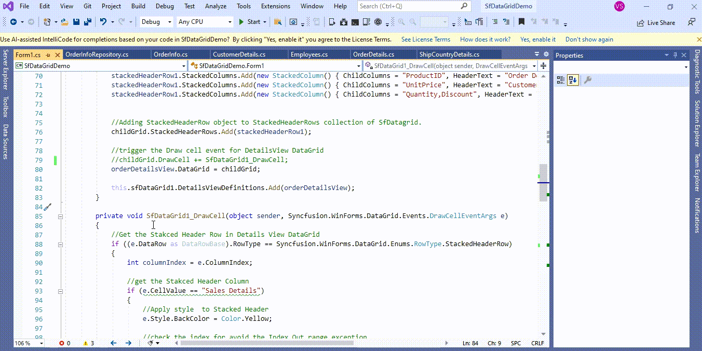
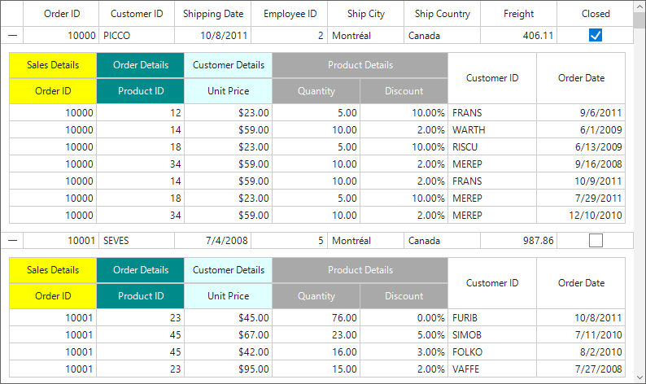

# How to apply column header style based on StackedHeadercolumn style in WinForms DetailsViewDataGrid (SfDataGrid)?

## About the sample
This example illustrates how to apply column header style based on StackedHeadercolumn style in [WinForms DetailsViewDataGrid](https://www.syncfusion.com/winforms-ui-controls/datagrid) (SfDataGrid)?

[WinForms DataGrid](https://www.syncfusion.com/winforms-ui-controls/datagrid) (SfDataGrid) does not provide the direct support to apply column header style based on [StackedHeaderColumn](https://help.syncfusion.com/cr/windowsforms/Syncfusion.WinForms.DataGrid.StackedColumns.html) style. You can apply column header based on [StackedHeaderColumn](https://help.syncfusion.com/cr/windowsforms/Syncfusion.WinForms.DataGrid.StackedColumns.html) style by customization the [DrawCell](https://help.syncfusion.com/cr/windowsforms/Syncfusion.WinForms.DataGrid.SfDataGrid.html#Syncfusion_WinForms_DataGrid_SfDataGrid_DrawCell) event in [WinForms DataGrid](https://www.syncfusion.com/winforms-ui-controls/datagrid) (SfDataGrid).

```C#

//trigger the Draw cell event for DetailsView DataGrid
childGrid.DrawCell += SfDataGrid1_DrawCell;

private void SfDataGrid1_DrawCell(object sender, Syncfusion.WinForms.DataGrid.Events.DrawCellEventArgs e)
{
     //Get the Stakced Header Row in Details View DataGrid
     if ((e.DataRow as DataRowBase).RowType == Syncfusion.WinForms.DataGrid.Enums.RowType.StackedHeaderRow)
     {
          int columnIndex = e.ColumnIndex;
          //get the Stakced Header Column 
          if (e.CellValue == "Sales Details")
          {
               //Apply style  to Stacked Header
               e.Style.BackColor = Color.Yellow;

               //check the index for avoid the Index Out range exception
               if (childGrid.StackedHeaderRows[e.RowIndex].StackedColumns.Count == e.ColumnIndex)
               columnIndex = e.ColumnIndex - 1;

               //get the Child Column of specific Stacked header column
               var childColumnName = childGrid.StackedHeaderRows[e.RowIndex].StackedColumns[columnIndex].ChildColumns.Split(',').ToList<string>();

               foreach (var stackedColumnName in childColumnName.ToList())
               {
                     //apply the Column Header Style based on Stacked Header child Columns
                     childGrid.Columns[stackedColumnName].HeaderStyle.BackColor = Color.Yellow;
               }
         }

         if (e.CellValue.ToString() == "Order Details")
         {
             //Apply style  to Stacked Header
             e.Style.BackColor = Color.DarkCyan;
             e.Style.TextColor = Color.White;

             if (childGrid.StackedHeaderRows[e.RowIndex].StackedColumns.Count == e.ColumnIndex)
                 columnIndex = e.ColumnIndex - 1;

             var childColumnName = childGrid.StackedHeaderRows[e.RowIndex].StackedColumns[columnIndex].ChildColumns.Split(',').ToList<string>();

             foreach (var stackedColumnName in childColumnName.ToList())
             {
                    //apply the Column Header Style based on Stacked Header child Columns
                    childGrid.Columns[stackedColumnName].HeaderStyle.BackColor = Color.DarkCyan;
                    childGrid.Columns[stackedColumnName].HeaderStyle.TextColor = Color.White;
             }
         }
         if (e.CellValue == "Customer Details")
         {
               e.Style.BackColor = Color.LightCyan;

               if (childGrid.StackedHeaderRows[e.RowIndex].StackedColumns.Count == e.ColumnIndex)
                   columnIndex = e.ColumnIndex - 1;

               var childColumnName = childGrid.StackedHeaderRows[e.RowIndex].StackedColumns[columnIndex].ChildColumns.Split(',').ToList<string>();

               foreach (var stackedColumnName in childColumnName.ToList())
               {
                    //apply the Column Header Style based on Stacked Header child Columns
                    childGrid.Columns[stackedColumnName].HeaderStyle.BackColor = Color.LightCyan;
               }
         }
         if (e.CellValue == "Product Details")
         {
             e.Style.BackColor = Color.DarkGray;
             e.Style.TextColor = Color.White;

            if (childGrid.StackedHeaderRows[e.RowIndex].StackedColumns.Count == e.ColumnIndex)
                  columnIndex = e.ColumnIndex - 1;
            var childColumnName = childGrid.StackedHeaderRows[e.RowIndex].StackedColumns[columnIndex].ChildColumns.Split(',').ToList<string>();

            foreach (var stackedColumnName in childColumnName.ToList())
            {
                 //apply the Column Header Style based on Stacked Header child Columns
                 childGrid.Columns[stackedColumnName].HeaderStyle.BackColor = Color.DarkGray;
                 childGrid.Columns[stackedColumnName].HeaderStyle.TextColor = Color.White;
            }
         }
     }
}

```



The following screenshot shows the column header style based on [StackedHeaderColumn](https://help.syncfusion.com/cr/windowsforms/Syncfusion.WinForms.DataGrid.StackedColumns.html) style, 



Take a moment to peruse the [WinForms DataGrid – Stacked Headers](https://help.syncfusion.com/windowsforms/datagrid/columns#stacked-headers) documentation, where you can find about stacked headers with code examples.

## Requirements to run the demo
Visual Studio 2015 and above versions
